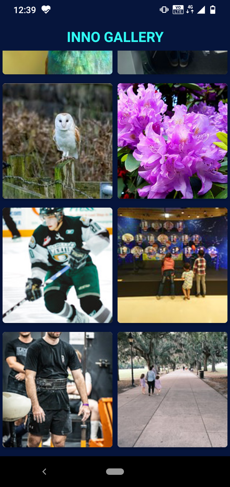
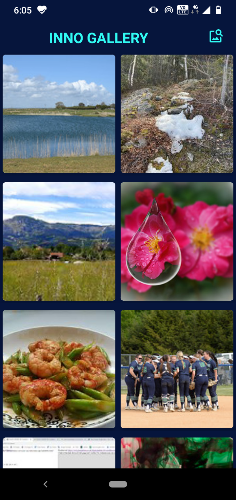
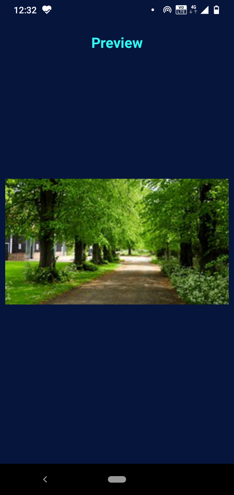
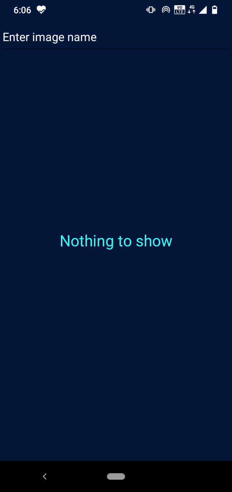
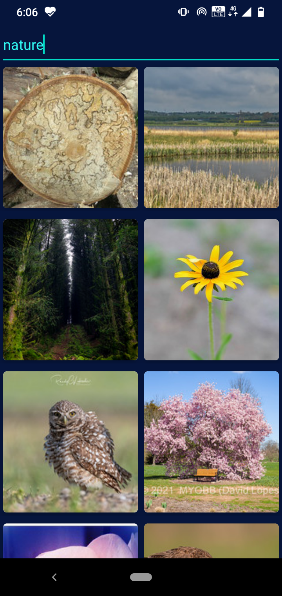
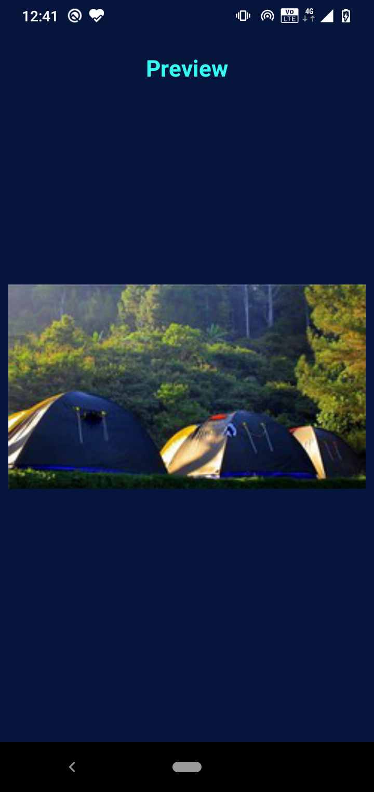
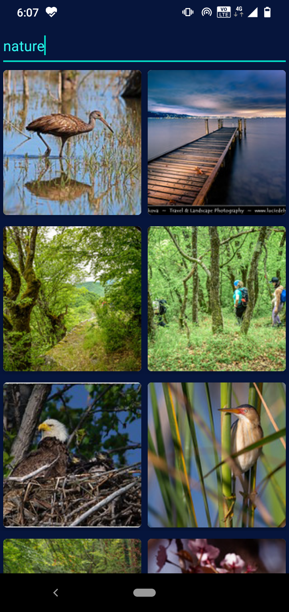
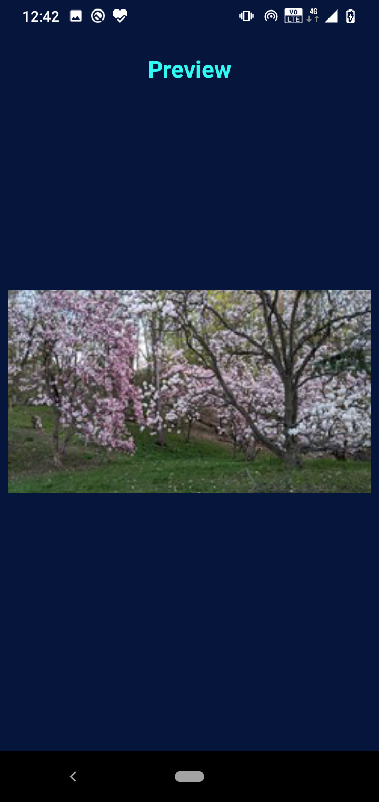
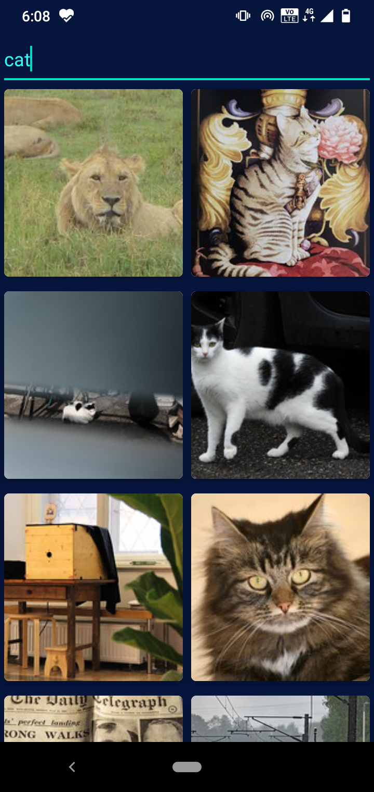

# Inno Gallery
Inno Gallery is a gallery app where you can enjoy the latest photos from all over the world.

### Things used in the app

* Retrofit
* Glide 
* ViewModel
* Kotlin Coroutines
* ViewBinding
* RecyclerView
* CardView

### Features

* Enjoy the latest images
* Search for your favorite photo
* Easily preview

### Screenshots

 

